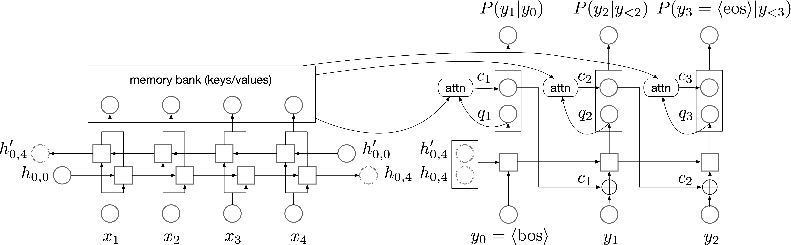

# TFLite-Micro-Seq2Seq
Attentional sequence-to-sequence model using TFLite Micro, tested on Arduino Nano 33 BLE

# Model Architecture

# Deployment to Arduino

The Arduino project can be found at [Arduino_Project](Arduino_Project). Compile and upload it to MCUs (we recommend using PlatformIO in VSCode, a tutorial can be found [here](https://maker.pro/arduino/tutorial/how-to-use-platformio-in-visual-studio-code-to-program-arduino)), and run. Note that there's already a pretrained model in `Arduino_Project/src/` so you can directly use it for a simple number-to-word task. 

# Training

The code for training a model and converting it to TFLite Micro can be found at this Google Colab Notebook: https://colab.research.google.com/drive/1d8Kz6P-7O0OAyFNSAoR0C2V48vldcjfA?usp=sharing

After training, two files will be generated: `c_src/model.h` and `c_src/model.cpp`. Download these two files and put them in the directory [Arduino_Project/src](Arduino_Project/src).

