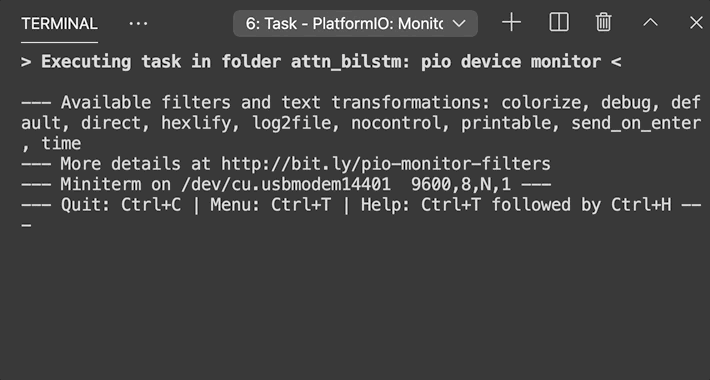

# TFLite-Micro-Seq2Seq

Attentional sequence-to-sequence modeling implemented in TFLite Micro, tested on Arduino Nano 33 BLE. Sequence-to-Sequence models can learn the mapping from a sequence of inputs to a sequence of outputs, and have been widely used in many applications including machine translation and speech recognition. This repo provides a trained model for a number-to-word task, where the model is given a number represented as a sequence of digits, and the goal is to convert it to English words (this task can be solved by writing simple rules, but here we use it to demonstrate the ability of a learning-based approach).

## Model Architecture

## Demo on Arduino Nano 33 BLE

## Deployment to Arduino

The Arduino project can be found at [Arduino_Project](Arduino_Project). Compile and upload it to MCUs (we recommend using PlatformIO in VSCode, a tutorial can be found [here](https://maker.pro/arduino/tutorial/how-to-use-platformio-in-visual-studio-code-to-program-arduino)), and run. Note that there's already a pretrained model in [Arduino_Project/src](Arduino_Project/src) so you can directly use it for a simple number-to-word task. 

## Training

The code for training a model and converting it to TFLite Micro can be found at this Google Colab Notebook: https://colab.research.google.com/drive/1d8Kz6P-7O0OAyFNSAoR0C2V48vldcjfA?usp=sharing

After training, two files will be generated: `c_src/model.h` and `c_src/model.cpp`. Download these two files and put them in the directory `Arduino_Project/src`.

## Video Presentation

An explanation about this project can be found at [bit.ly/tinyseq2seq](http://bit.ly/tinyseq2seq).

## Contact

Yuntian Deng (dengyuntian@seas.harvard.edu)

## Acknowledgments

This is a course project of [CS249r TinyML](https://scholar.harvard.edu/vijay-janapa-reddi/classes/cs249r-tinyml) at Harvard, and I am grateful to the teaching fellows for their help during this project.
